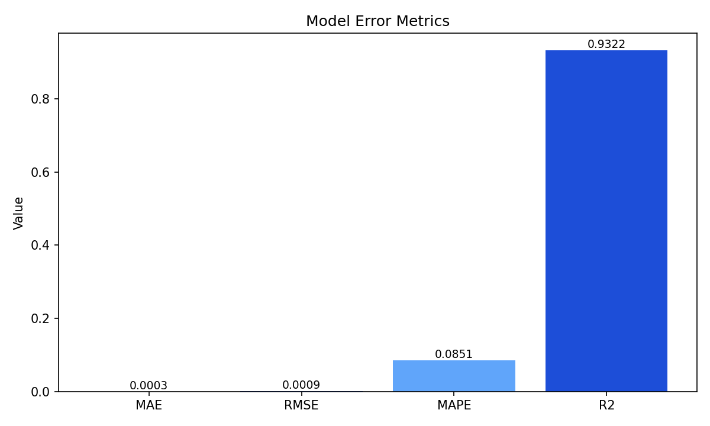
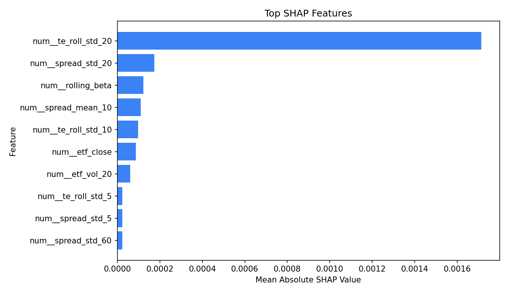
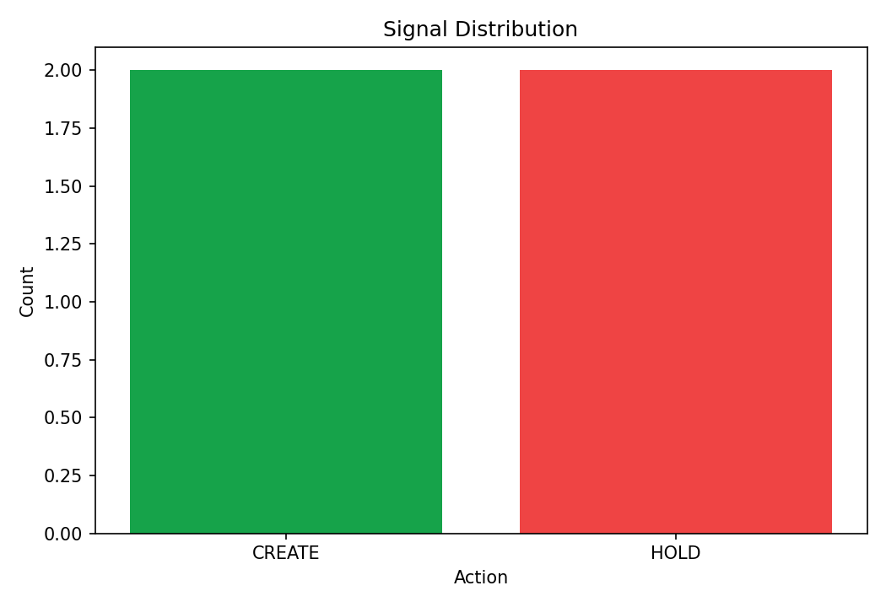
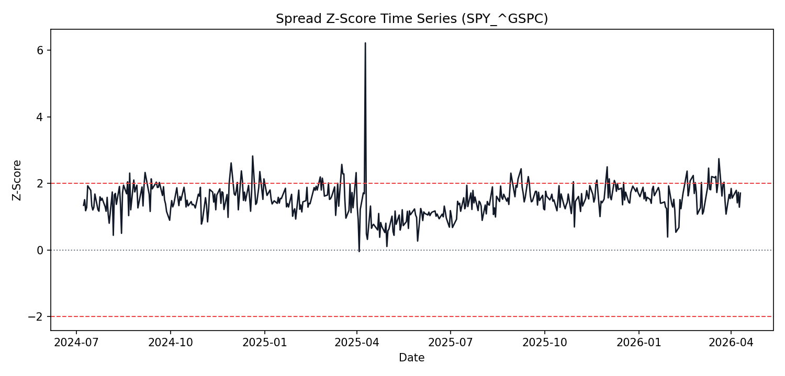

# ETF Tracking Error Prediction & Arbitrage Detection

## Project Objective
This project builds an end-to-end machine learning system to predict ETF tracking error against benchmark indices and detect potential statistical arbitrage opportunities in near real time.

### Plain-English Summary (For Non-Financial Readers)
- An ETF is a fund you can trade like a stock.
- Each ETF tries to follow a reference market index (for example the S&P 500).
- Sometimes the ETF and its index do not move exactly together.
- The size of this mismatch is called tracking error.
- This project predicts that mismatch ahead of time and raises signals when the mismatch may be tradable.

If you are new to finance, you can think of this as a "difference forecasting" system:
- Input: recent ETF and index prices/volumes.
- Model output: expected future difference between ETF behavior and index behavior.
- Signal output: whether to `CREATE`, `REDEEM`, or `HOLD` ETF inventory based on confidence, liquidity, and expected net profit.

The platform is designed for bank risk management and trading workflows. It includes:
- Robust market data collection for ETFs and benchmarks.
- Feature engineering for daily and intraday tracking behavior.
- A predictive model for forward tracking error.
- A signal engine for abnormal ETF-index dislocations.
- Portfolio-level risk aggregation (total TE risk, TE VaR, sector exposure, ETF risk contribution).
- Explainability outputs with SHAP and counterfactual analysis.
- A Streamlit dashboard for analysts and risk managers.

## Business & Regulatory Context
Tracking error is a core risk indicator for index-tracking products. In a bank environment, it matters for:
- Product governance: verifying that ETF behavior remains consistent with mandate and disclosures.
- Market risk: monitoring sudden divergence from benchmark dynamics.
- Trading surveillance: detecting temporary dislocations that can become arbitrage opportunities.
- Client reporting: explaining observed deviations with transparent drivers.

From a regulatory perspective, the pipeline supports model risk management principles:
- Traceability: deterministic preprocessing and explicit model artifacts.
- Explainability: SHAP feature attributions and what-if counterfactuals.
- Monitoring readiness: clear metrics and threshold-based signal logic.
- Auditability: reproducible notebooks and modular source code.

## Dataset
### Core Terms (Quick Glossary)
- ETF: Exchange-Traded Fund; a basket of assets traded on exchange.
- Benchmark (or Index): the target market the ETF tries to track.
- Return: percentage price change from one period to the next.
- Volatility: how much returns fluctuate over time.
- Tracking Error (TE): volatility of the ETF-index return difference.
- Intraday: data inside the same trading day (for example every 5 minutes).
- Basis Point (bp): one hundredth of one percent. 1 bp = 0.01%.

### Data Sources
Data is retrieved from Yahoo Finance through `yfinance`, using real listed instruments and benchmark proxies:
- `SPY` vs `^GSPC` (S&P 500 index)
- `ESE.PA` vs `^GSPC` (Euronext-listed S&P 500 UCITS ETF)
- `QQQ` vs `^NDX` (Nasdaq-100 index)
- `FEZ` vs `^STOXX50E` (Euro Stoxx 50)
- `URTH` vs `ACWI` (MSCI World proxy)
- `BNK.PA` vs `^FCHI` (French-listed Europe banks UCITS ETF vs CAC 40)
- `BNKE.L` vs `^STOXX50E` (STOXX Europe 600 Banks UCITS ETF vs Euro Stoxx 50)
- `EUFN` vs `^STOXX` (MSCI Europe Financials proxy ETF vs STOXX benchmark)

Daily and intraday bars are supported.

### Features Collected
For each ETF-benchmark pair:
- Open, High, Low, Close, Volume
- Arithmetic and log returns
- Forward return alignment for target construction
- Relative spread and rolling volatility descriptors

### Preprocessing
Main preprocessing steps:
- Timestamp alignment between ETF and benchmark.
- Missing value handling with forward fill and conservative drop rules.
- Return computation after sorted, timezone-safe index normalization.
- Pair-wise panel assembly with explicit `pair` identifier.

## Methodology
### Feature Engineering
The feature pipeline is implemented in `src/features.py` and includes:
- Lagged ETF and benchmark returns.
- Rolling volatility (ETF, benchmark, and difference).
- Rolling beta estimate from covariance/variance.
- Price ratio and ratio z-score.
- Rolling tracking error statistics.
- Volume pressure and micro-trend indicators.

Feature windows are intentionally heterogeneous (short, medium, long) to capture both short-lived dislocations and persistent drift.

In simple terms, feature engineering means we transform raw prices into useful signals such as:
- "How much did ETF and index move recently?"
- "Is the ETF moving more wildly than usual?"
- "Is the ETF consistently above or below its normal relationship with the index?"

### Model Architecture
The prediction model is implemented in `src/models.py`:
- Main estimator: `HistGradientBoostingRegressor`.
- Input: engineered features at time $t$.
- Output: expected tracking error over horizon $h$.
- Scaling: robust scaling to reduce sensitivity to heavy tails.
- Validation: time-based split to respect causality.

Why this architecture:
- Fast training and inference.
- Strong non-linear fit without deep learning complexity.
- Compatible with SHAP explainability.

Plain language:
- The model learns patterns from historical examples.
- It does not just fit a straight line; it can capture complex relationships.
- It is fast enough to run repeatedly in production workflows.

### Tracking Error Modeling
The model predicts forward realized tracking error estimated from ETF-benchmark return differences. The target can be configured for daily or intraday horizons.

Interpretation:
- "Forward" means we predict what happens next, not what already happened.
- If predicted TE is high, ETF/index mismatch risk is expected to be higher.
- If predicted TE is low, ETF behavior is expected to stay closer to the benchmark.

The framework supports:
- Pair-specific modeling.
- Unified cross-pair modeling (single model with `pair` feature encoding).
- Rolling retrain process for production refresh.

### Arbitrage Detection Logic
Arbitrage signaling is implemented in `src/arbitrage_signal.py` and combines:
- Predicted tracking error direction and magnitude.
- Persistence score from recent realized tracking error.
- Liquidity score from recent ETF dollar volume.
- Conservative confidence thresholding (`CREATE`/`REDEEM` only when confidence >= 0.70).
- Net-profit estimate after explicit transaction costs and slippage.

Signal categories:
- `CREATE`
- `REDEEM`
- `HOLD`

What these actions mean in practice:
- `CREATE`: ETF appears rich (premium). Desk can create shares and potentially monetize the gap.
- `REDEEM`: ETF appears cheap (discount). Desk can redeem shares and potentially monetize the gap.
- `HOLD`: no sufficiently strong, liquid, and profitable setup.

This design is intentionally risk-aware. Position size is reduced aggressively when confidence is weak, and no trade is recommended when expected net edge is not attractive.

## Key Equations
### Notation Guide
- $P_t$: price at time $t$.
- $r_t$: arithmetic return at time $t$.
- $\ell_t$: log return at time $t$.
- $w$: rolling window length (number of past observations).
- $h$: prediction horizon (how far ahead we forecast).
- $\varepsilon$: very small constant to avoid division by zero.

### Return Definitions
$$
r_t = \frac{P_t}{P_{t-1}} - 1
$$
This is the arithmetic return of an asset from $t-1$ to $t$.

Example: if price goes from 100 to 101, then $r_t = 1\%$.

$$
\ell_t = \ln\left(\frac{P_t}{P_{t-1}}\right)
$$
This is the log return, useful for additive time aggregation.

Why log returns: they are often more convenient for statistical modeling over many periods.

### Instantaneous Tracking Difference
$$
d_t = r^{ETF}_t - r^{IDX}_t
$$
This measures one-period return divergence between ETF and benchmark.

Intuition: if ETF rises by 0.40% and index rises by 0.30%, then $d_t = 0.10\%$.

### Realized Tracking Error (Rolling)
$$
TE_t^{(w)} = \sqrt{\frac{1}{w-1}\sum_{i=t-w+1}^{t} \left(d_i - \bar{d}_{t,w}\right)^2}
$$
This is the rolling standard deviation of return differences over window $w$.

Intuition: this is the "typical size" of ETF-index mismatch recently.

### Forward Target Construction
$$
y_t = TE_{t+h}^{(w)}
$$
The supervised target is the tracking error observed at horizon $h$ in the future.

Interpretation: the model learns to predict future mismatch using information available now.

### Rolling Beta
$$
\beta_t^{(w)} = \frac{\operatorname{Cov}_w\left(r^{ETF}, r^{IDX}\right)}{\operatorname{Var}_w\left(r^{IDX}\right) + \varepsilon}
$$
This quantifies ETF sensitivity to benchmark moves in a rolling window.

Interpretation: when $\beta \approx 1$, ETF tends to move similarly to the index.

### Spread Z-Score for Arbitrage
$$
z_t = \frac{s_t - \mu_t^{(w)}}{\sigma_t^{(w)} + \varepsilon}
$$
Here $s_t$ is a spread proxy (for example log-price ratio). Large $|z_t|$ suggests abnormal dislocation.

Interpretation: z-score tells us how unusual the current spread is relative to recent history.

### Mean-Reversion Half-Life
Given an AR(1) estimate $x_t = \phi x_{t-1} + \eta_t$,
$$
	ext{HalfLife} = -\frac{\ln(2)}{\ln(|\phi|)}
$$
This approximates time needed for half of a shock to decay.

Interpretation: smaller half-life means quicker return to normal conditions.

## Evaluation Metrics & Results
Model quality is evaluated with:
- MAE for absolute error magnitude.
- RMSE for tail-sensitive error.
- $R^2$ for explained variance.
- MAPE (with safe denominator) for relative error context.

For non-technical readers:
- Lower MAE/RMSE/MAPE is better (smaller prediction errors).
- Higher $R^2$ is better (more variance explained by the model).

### Current Backtest Snapshot (2Y, Daily, All Pairs)
The following metrics were generated from the current trained artifact and latest 2-year daily dataset:

| Metric | Value |
|---|---:|
| MAE | 0.00026913 |
| RMSE | 0.00086908 |
| MAPE | 0.08512167 |
| $R^2$ | 0.932239 |
| Scored Rows | 349 |

### Latest Pair Signal Snapshot
| Pair | Action | Confidence | Recommended Shares | Notional (USD) | Estimated Net Profit (USD) |
|---|---|---:|---:|---:|---:|
| URTH_ACWI | CREATE | 0.8833 | 7,033 | 1,325,000 | 1,358.58 |
| FEZ_^STOXX50E | CREATE | 0.8600 | 19,563 | 1,290,000 | 21,344.44 |
| SPY_^GSPC | HOLD | 0.4876 | 0 | 0 | 0.00 |
| QQQ_^NDX | HOLD | 0.4728 | 0 | 0 | 0.00 |

### Visual Results
#### 1) Model Error Metrics


#### 2) SHAP Feature Importance (Top 10)


#### 3) Arbitrage Signal Distribution


#### 4) Spread Z-Score with Entry Thresholds


Signal engine quality can be monitored with:
- Precision of arbitrage flags against realized mean-reversion outcomes.
- Hit ratio under execution delay assumptions.
- Average normalized spread capture.

Plain-language interpretation of signal quality:
- Precision: among signals we acted on, how many were good calls?
- Hit ratio: how often does a signal make money after realistic delays?
- Spread capture: how much of the temporary mispricing we actually monetize.

Typical expected behavior (instrument and period dependent):
- Higher accuracy in stable volatility regimes.
- Wider forecast errors during stress or opening auction intervals.
- Fewer but higher-conviction arbitrage actions due to confidence and net-edge gating.

## Repository Structure
```text
ETF-error-tracking/
├─ assets/
│  └─ charts/
│     ├─ model_metrics.png
│     ├─ shap_top10.png
│     ├─ signal_distribution.png
│     └─ zscore_timeseries.png
├─ app.py
├─ config.py
├─ main.py
├─ predict.py
├─ README.md
├─ requirements.txt
├─ notebooks/
│  ├─ 01_data_collection.ipynb
│  ├─ 02_feature_engineering.ipynb
│  ├─ 03_model_training.ipynb
│  └─ 04_results_and_evaluation.ipynb
└─ src/
	├─ __init__.py
	├─ arbitrage_detector.py
	├─ arbitrage_signal.py
	├─ data_loader.py
	├─ explainability.py
	├─ features.py
	├─ models.py
	├─ real_time_predictor.py
	└─ utils.py
```

## Installation and Execution
### 1) Create and activate environment
```bash
python -m venv .venv
```

Windows PowerShell:
```bash
.venv\Scripts\Activate.ps1
```

Linux/macOS:
```bash
source .venv/bin/activate
```

### 2) Install dependencies
```bash
pip install -r requirements.txt
```

### 3) Train and persist model artifact
```bash
python predict.py --train --lookback-period 2y --interval 1d --horizon 1 --window 20
```

### 4) Run batch prediction from saved model
```bash
python predict.py --predict --model-path artifacts/te_model.joblib --lookback-period 6mo --interval 1d
```

### 5) Launch Streamlit dashboard
```bash
python -m streamlit run app.py
```

### 6) Run real-time CLI workflow
```bash
python predict.py --real-time --intraday-period 60d --intraday-interval 5m
```

### 7) Run notebooks
Open notebooks in order:
1. `notebooks/01_data_collection.ipynb`
2. `notebooks/02_feature_engineering.ipynb`
3. `notebooks/03_model_training.ipynb`
4. `notebooks/04_results_and_evaluation.ipynb`
